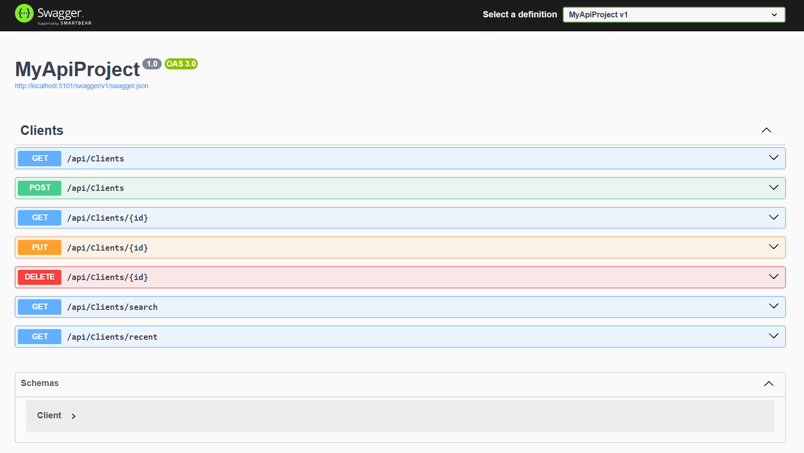
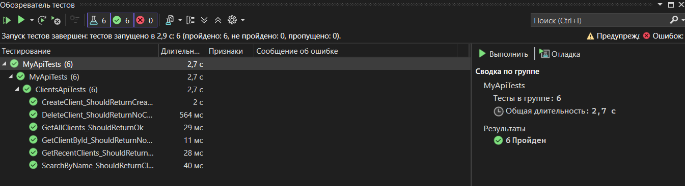

# MyApiProject — REST API in C# / .NET 8

A REST API for managing clients, built as a learning project to demonstrate backend development skills in C# and .NET, database integration, test automation, and API documentation.

## Technologies

- Language: C#
- Platform: .NET 8
- Framework: ASP.NET Core
- Database: MS SQL Server (LocalDB)
- ORM: Entity Framework Core
- API Documentation: Swagger / OpenAPI
- Testing: NUnit + RestSharp
- Version Control: Git + GitHub

## Implemented API Endpoints

- GET /api/clients — retrieve all active clients (excluding soft-deleted)
- GET /api/clients/{id} — retrieve a client by ID
- POST /api/clients — create a new client (name, phone, email)
- PUT /api/clients/{id} — fully update an existing client
- DELETE /api/clients/{id} — soft delete (sets IsDeleted = true, keeps the record in the database)
- GET /api/clients/search?name= — search clients by partial name (case-insensitive)
- GET /api/clients/recent?days= — filter clients created within the last N days

## Database

A Clients table was designed with the following fields:
- Id (primary key)
- Name
- Phone
- Email
- CreatedAt
- IsDeleted (soft-delete flag)

The schema was created using Entity Framework migrations. A connection string to a local SQL Server (LocalDB) is configured.

## Testing

Six automated tests were written using NUnit and RestSharp to cover all major scenarios: data retrieval, creation, updating, deletion, search, and filtering.

## API Documentation

All endpoints are documented and available for interactive testing through Swagger UI, generated automatically from controller attributes.

## Project Structure

- Controllers/ClientsController.cs — contains all endpoints and business logic
- Models/Client.cs — client data model
- Data/AppDbContext.cs — Entity Framework database context
- appsettings.json — database connection string
- MyApiTests/ClientsApiTests.cs — automated tests

## Screenshots

### Swagger UI

### Test Results

Telegram: @dle_ka  
Email: dretogh2@gmail.com  
GitHub: https://github.com/dle-ka
